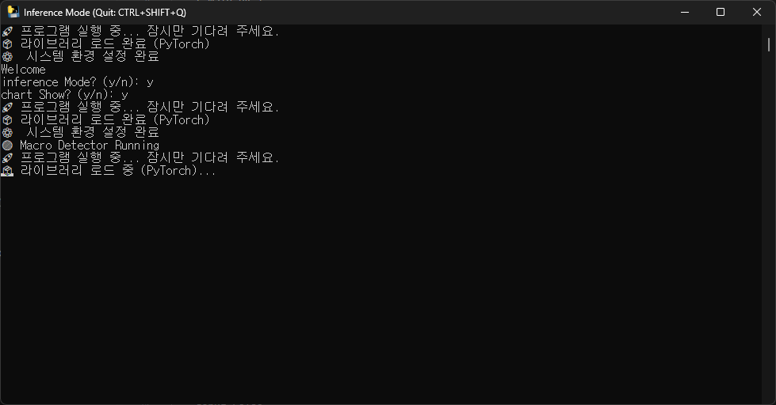

# 🤖 Model Architecture: Transformer Macro Autoencoder

Transformer 기반의 오토인코더(Autoencoder) 구조
- 정상 패턴: 모델이 높은 정확도로 복원하여 재구성 오차 0에 수렴합니다.
- 이상 패턴(매크로): 모델이 학습하지 못한 패턴이므로 복원 능력이 떨어져 재구성 오차가 높게 발생합ㄴ다.

- Feature Embedding : 5차원의 입력 피처(x, y, dist 등)를 d_model(64차원)의 고차원 벡터로 확장하여 복잡한 상관관계를 학습할 준비를 합니다.
- Positional Encoding : Transformer는 RNN과 달리 순서 정보가 없으므로, 시퀀스 내 각 위치 정보($1^{st}, 2^{nd}, ...$)를 나타내는 벡터를 더해줍니다.
- Transformer Encoder : Multi-Head Self-Attention 메커니즘을 통해 시퀀스 전체를 동시에 훑으며, 과거의 움직임이 현재에 미치는 영향을 파악합니다.
- Linear Decoder : 인코더가 뽑아낸 추상적인 특징들을 다시 원래의 5개 피처 차원으로 복원합니다.

Detection Logic
- Normal Patterns: The model reconstructs these with high precision, causing the reconstruction error to converge to zero.
- Anomalous Patterns (Macro): Since these are patterns the model has not encountered during training, the reconstruction capability decreases, resulting in a high reconstruction error.

- Feature Embedding: Expands the 5-dimensional input features (e.g., $x, y, dist$) into a high-dimensional vector of $d_{model}$ (64 dimensions) to prepare the model for learning complex correlations.
- Positional Encoding: Since Transformers do not inherently process sequential order like RNNs, this adds vectors that represent the positional information ($1^{st}, 2^{nd}, \dots$) within the sequence.
- Transformer Encoder: Utilizes the Multi-Head Self-Attention mechanism to scan the entire sequence simultaneously, capturing how past movements influence the present state.
- Linear Decoder: Reconstructs the abstract features extracted by the encoder back into the original 5-feature dimensions.


## 🚀 Update Ver 0.0.2

### 🛠 Features
* **Enhanced Tracking Precision:** Added **Tolerance** settings. Lowering this value allows for finer, high-resolution mouse data sampling.
* **Optimized Inference Stability:** Implemented **Temporal Filtering** via Tolerance to ensure consistent inference and training performance, even in low-frequency (Low Hz) environments.
* **Improved System Resilience (Protection Mode):** Integrated a fail-safe protocol to prevent application crashes and maintain recording stability when navigating restricted windows (e.g., Task Manager).
* **Model Training Upgrade:** Increased training **Epochs** from 50 to 300 for improved pattern recognition accuracy.
* **Centralized Configuration:** Migrated initial setup parameters to `config.json` for easier environment and hyperparameter management.
* **Refined Detection Output:** Updated the Macro Detection UI and log format for enhanced readability and real-time monitoring.

Start New Mouse Recording feat Macro_Data 기능 추가 macro data
Json Data Inference 기록된 json 파일로 검사
여러 가지 조정할수 있는 값들 패널에 부착
plot ui 변경


### 🔴 Critical Fixes

* **Event-Driven Movement Tracking & Physical Delta Logic**
    * **Issue:** The previous polling-loop system captured mouse positions at fixed artificial intervals. This "digitized" the data, forcing points to be recorded at exactly 0.02s regardless of the actual physical hardware signal, which caused the loss of natural human acceleration and micro-timing dynamics.
    * **Fix:** Migrated from a Polling-loop to an **OS-level Event Listener** (`pynput.mouse.Listener`). The system now captures the "Actual Physics" of movement by calculating the time elapsed between real hardware interrupts.
    * **Logic:** 1. **Movement-Triggered:** Data capture is initiated by physical mouse movement, not a clock timer.
        2. **Threshold Filtering:** An entry is recorded only if the `delta_time` since the last recorded event exceeds the defined `tolerance` (0.02s).
        3. **Raw Delta Preservation:** Instead of forcing a normalized 0.02s, the system records the **exact high-precision time** (e.g., 0.0209s, 0.0215s) when the coordinate change occurred.
    * **Result:** Captures high-fidelity, human-centric movement data. The recorded `deltatime` now reflects real-world acceleration and velocity curves, significantly improving the Macro/Bot detection model's ability to distinguish between organic human input and synthetic patterns.

* **Data Integrity & Feature Engineering**
    * By consolidating micro-steps into ~20ms packets, the model can more accurately distinguish between the **consistent mechanical velocity** of a macro and the **variable reaction-time jitters** of a human user.
    * This normalization is critical for accurate acceleration ($a = \Delta v / \Delta t$) and jerk ($j = \Delta a / \Delta t$) feature engineering in AI training.

### ✨ UI & UX Improvements
* **Refined Interface:** Polished the UI components for a more modern and sophisticated look.
* **Tray Mode Integration:** Added a **"Minimize to Tray"** feature to keep the application running in the background, ensuring a clutter-free workspace while maintaining active monitoring.

---

## 🚀 Update Ver 0.0.1

### 🔧 Features
* **CLI Mode Expansion:** Inference Mode now officially supports both **Windows CMD** and **Linux Terminal** environments for broader compatibility.
* **Portable Release:** Executables are now bundled and distributed as **ZIP archives** via PyInstaller, allowing for easy deployment without complex installation.

### ⌨️ Shortcuts & Commands
* **Inference Mode (CLI):** - `Start` => `Inference Mode` => `Yes`
* **Inference Mode (UI):** - `UI` => `Inference Mode` => `No`
* **Emergency Quit:** `Ctrl + Shift + Q`



---

## 📂 Data Management
* **Database Support:** Efficient data handling using **PostgreSQL** and **JSON** formats.

## 🛠 Installation
* To install the required dependencies, run the following command:
  ```bash
  pip install -r requirements.txt

## 사용 설명서 (Manual)
Manual.pptx

## 영상
[](https://youtu.be/iwi31PxQc3I)